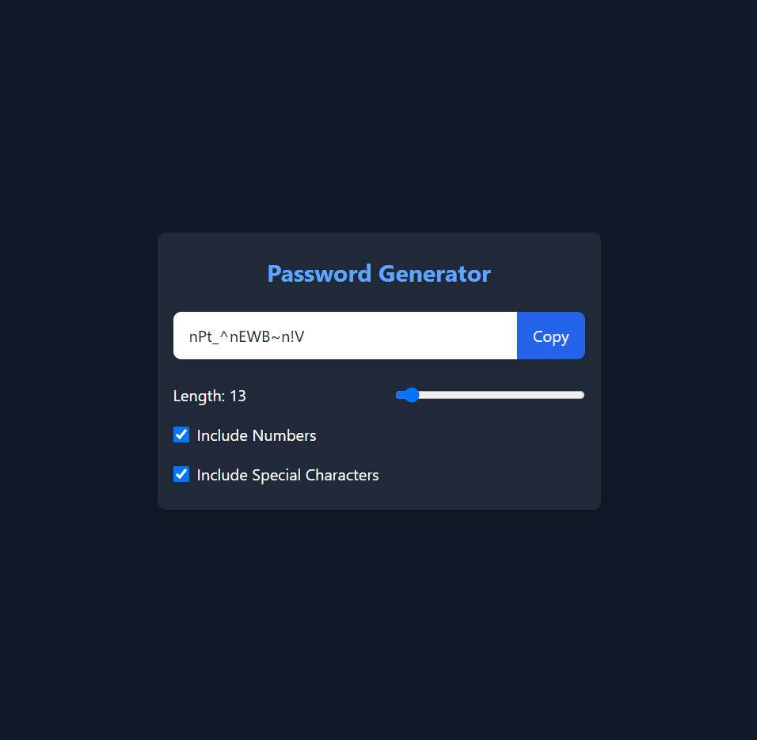

# Password Generator

A simple React.js application to generate secure, random passwords.



## Features

- Generate strong passwords with customizable length
- Option to include uppercase, lowercase, numbers, and symbols
- Copy generated password to clipboard
- Responsive and user-friendly interface

## Getting Started

### Prerequisites

- Node.js (v14 or higher)
- npm or yarn

### Installation

```bash
git clone https://github.com/yourusername/password-generator.git
cd password-generator
npm install
```

### Running the App

```bash
npm start
```

The app will be available at `http://localhost:3000`.

## Usage

1. Select desired password options (length, character types).
2. Click **Generate** to create a new password.
3. Click **Copy** to copy the password to your clipboard.

## License

This project is licensed under the MIT License.

---

*Feel free to contribute or open issues for suggestions and improvements!*